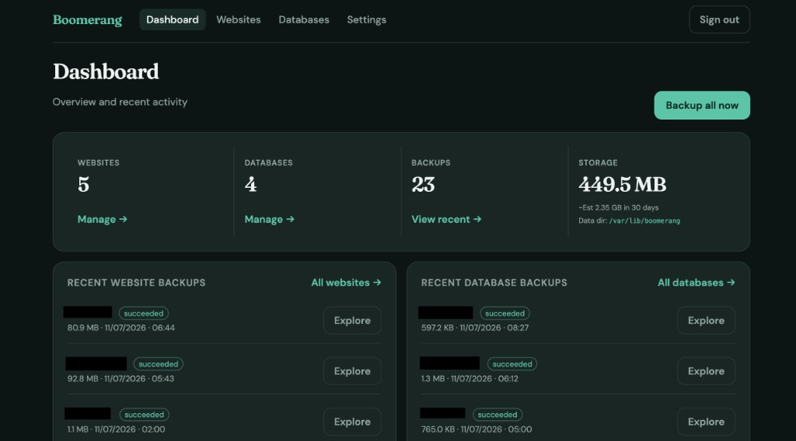

# 🪃 Boomerang

**Your backups come back.** Boomerang is a small, self-hosted backup appliance you run on your own Linux box — pull website files and MySQL databases on a schedule, keep versions, restore when things go wrong, and get emailed when a job fails.

One Go binary, built-in web UI, no cloud subscription. Data stays on **your** server under `/var/lib/boomerang`.



---

## 🤔 What is this for?

Boomerang is the **backup box** — not the website server. It lives on your network (LXC, VPS, or spare machine) and **pulls** copies from your real servers:

- **Websites** — SFTP, RSYNC, or FTP/FTPS (WordPress files, configs, uploads, …)
- **Databases** — MySQL/MariaDB dumps (full or selected tables)

You get a timeline of versions, browse files inside a backup, restore selected paths back to the live server, download a zip or SQL dump, or roll back database tables — without paying for a hosted backup SaaS.

### Example setups

**Home lab (Proxmox)**  
- CT `192.168.1.50` runs Boomerang  
- Another CT or Pi hosts your site over SFTP + MariaDB  
- Firewall on the site: allow SSH/MySQL **only** from `192.168.1.50`

**Small business site**  
- Boomerang on an internal VM  
- Nightly SFTP backup of `/var/www/html`  
- Nightly `mysqldump` of the WordPress DB via SSH tunnel  
- Email alert if a backup fails overnight

**After a bad deploy**  
- Open **Explore backups** → pick yesterday's version → restore `wp-content/uploads` only  
- Or restore selected MySQL tables (e.g. `wp_posts`, `wp_options`) with a pre-restore table diff

---

## ✨ Features

- 📁 **Website backups** — SFTP (recommended), RSYNC (full snapshot each run), FTP/FTPS; include/exclude paths; optional incremental chains (SFTP/FTP)
- 🗄️ **Database backups** — MySQL with direct or SSH-tunnel connection; per-table dumps for safer restores
- 🔍 **Explore & restore** — browse backup trees, search, selective restore, download zip/SQL, verify integrity (files + databases)
- 📅 **Schedules & retention** — friendly “every N hours” UI or cron; hourly/daily/weekly/monthly/yearly keep counts
- ⚡ **Bulk backup** — backup all websites or all databases in one click
- 🛑 **Job cancel** — cancel queued or in-progress backup jobs from the UI
- 📧 **Alerts** — local mail (postfix) or custom SMTP; backup/restore/off-site mirror failure toggles
- 🔐 **Encrypted at rest** — credentials and backup blobs encrypted with a local master key
- ☁️ **Off-site mirror** — optional automatic copy to **Cloudflare R2** after each backup (3-2-1); dashboard banner when sync is stale or failed
- 🔄 **Restore from R2** — import a previous appliance on first install (before admin password is set)
- 📊 **Storage forecast** — retention-aware estimate of disk use over the next 30 days
- 📡 **Server monitoring** — optional Linux agent reports CPU, RAM, disk, load, and uptime over existing SSH (no new ports); history graphs and threshold emails
- 🗑️ **Delete versions** — remove individual backups you no longer need
- ⬆️ **In-app updates** — Settings → Updates checks GitHub releases and installs on systemd appliances

---

## 📋 Requirements

| Component | Purpose |
|-----------|---------|
| **Linux** | Debian 12+, Ubuntu 22.04+, or similar (**systemd** for native install) |
| **openssh-client** | SFTP / RSYNC / SSH tunnels |
| **rsync** | RSYNC backups |
| **default-mysql-client** | `mysqldump` / `mysql` |
| **postfix** (optional) | Local email alerts |

**Disk:** Plan for the full size of everything you retain (file + DB versions).  
**RAM:** 512 MB+ is fine for small sites.

`install.sh` runs a system check before installing (OS, disk, RAM, systemd, port 8080).

---

## 🚀 Install

Pick the method that matches your host. All native installs use the same `install.sh` script and create a **systemd** service with data in `/var/lib/boomerang`.

| Platform | Best for | In-app updates (Settings → Updates) |
|----------|----------|-------------------------------------|
| **Debian** | Bare metal, VM, or generic LXC | Yes |
| **Ubuntu** | Bare metal, VM, or cloud VPS | Yes |
| **LXC (Proxmox)** | Home lab — one-liner creates the CT | Yes |
| **Docker** | Quick tests, non-systemd hosts | No — pull a newer image tag |

After install, open **`http://YOUR_SERVER_IP:8080`**, set your admin password on first visit, add targets, and run a backup.

> 🔒 Keep port **8080** on your LAN only. Boomerang is HTTP + single password — use a reverse proxy with TLS if exposing beyond your network.

### Debian

**Tested:** Debian 12+ (Bookworm). Needs **systemd** and **apt**.

**Suggested resources:** 1 vCPU, 512 MB–1 GB RAM, **20 GB+** disk.

```bash
apt-get update && apt-get install -y git
git clone https://github.com/supermaribo/boomerang.git
cd boomerang
chmod +x install.sh
sudo ./install.sh --from-release
```

Pin a release:

```bash
sudo ./install.sh --from-release v0.1.0
```

**Upgrade**

```bash
cd boomerang && git pull
sudo ./install.sh --from-release
```

Or use **Settings → Updates** in the UI.

---

### Ubuntu

**Tested:** Ubuntu 22.04+ (Jammy, Noble). Same installer as Debian.

```bash
apt-get update && apt-get install -y git
git clone https://github.com/supermaribo/boomerang.git
cd boomerang
chmod +x install.sh
sudo ./install.sh --from-release
```

Build from source (development):

```bash
sudo ./install.sh
```

**Upgrade:** `git pull` then `sudo ./install.sh --from-release`, or **Settings → Updates**.

---

### LXC (Proxmox VE)

**Suggested CT:** Debian 12, 1 vCPU, 512 MB–1 GB RAM, **20 GB+** disk, outbound SSH/MySQL to your backup targets.

#### Option A — one-liner (recommended)

Paste into the **Proxmox host** shell (not inside an existing CT):

```bash
bash -c "$(curl -fsSL https://raw.githubusercontent.com/supermaribo/boomerang/main/deploy/proxmox/ct-boomerang.sh)"
```

Uses the [community-scripts](https://community-scripts.org) LXC wizard, downloads the latest [GitHub release](https://github.com/supermaribo/boomerang/releases), and starts systemd. When finished:

- UI: `http://<container-ip>:8080`

Upstream-ready files for [community-scripts.org](https://community-scripts.org) live in [`deploy/proxmox/upstream/`](deploy/proxmox/upstream/). See [`deploy/proxmox/SUBMIT.md`](deploy/proxmox/SUBMIT.md) for the ProxmoxVED PR checklist.

#### Option B — manual install inside an existing CT

Create a Debian 12 unprivileged CT yourself, then as **root** inside it:

```bash
apt-get update && apt-get install -y git
git clone https://github.com/supermaribo/boomerang.git
cd boomerang
sudo ./install.sh --from-release
```

#### Upgrade (Proxmox)

**No git clone?** Proxmox one-liner installs do not leave `install.sh` in your home directory. Use the standalone upgrade script **inside the CT**:

```bash
curl -fsSL https://raw.githubusercontent.com/supermaribo/boomerang/main/deploy/upgrade.sh | sudo bash
```

Pin a release: `curl -fsSL .../deploy/upgrade.sh | sudo bash -s v0.1.0`

**From the UI:** Settings → Updates (when a newer release exists).

**With git clone** (after `git clone` once into `~/boomerang`):

```bash
cd boomerang && git pull && sudo ./install.sh --from-release
```

**From the Proxmox host** (replace `100` with your CT ID):

```bash
pct exec 100 -- bash -c 'curl -fsSL https://raw.githubusercontent.com/supermaribo/boomerang/main/deploy/upgrade.sh | bash'
```

---

### Docker

For testing or hosts where you prefer a container over systemd. **Use custom SMTP** for email (no local postfix in the image). In-app updates are **not** available — pull a newer image tag to upgrade.

**Published image** (multi-arch on [Docker Hub](https://hub.docker.com/r/supermaribos/boomerang)):

```bash
docker pull supermaribos/boomerang:latest
docker run -d --name boomerang -p 8080:8080 \
  -v boomerang-data:/var/lib/boomerang \
  --restart unless-stopped \
  supermaribos/boomerang:latest
```

Or with compose:

```bash
curl -fsSL https://raw.githubusercontent.com/supermaribo/boomerang/main/docker-compose.hub.yml -o docker-compose.hub.yml
BOOMERANG_VERSION=0.1.8 docker compose -f docker-compose.hub.yml up -d
```

**Build from source** (development):

```bash
git clone https://github.com/supermaribo/boomerang.git
cd boomerang
BOOMERANG_VERSION=dev docker compose up -d --build
```

UI: **http://localhost:8080**

**Upgrade (Docker Hub)**

```bash
docker pull supermaribos/boomerang:0.1.8
docker compose -f docker-compose.hub.yml up -d
```

See [`deploy/docker/README.md`](deploy/docker/README.md) for CI publishing and GitHub secrets setup.

---

### Install script reference

```text
sudo ./install.sh [options] [path/to/boomerang-binary]

  --from-release [TAG]   Download binary from GitHub (default TAG: latest)
  --release TAG          Same as --from-release TAG
  --no-build             Use an existing binary (skip compile)
  --binary PATH          Same as passing PATH as the last argument
  -h, --help             Show help
```

Low-level install (binary + systemd only):

```bash
sudo bash deploy/install.sh /path/to/boomerang
```

### Server monitoring agent

On each Linux VPS you want to monitor (requires sudo once):

1. In Boomerang open **Monitoring → Add server** and copy the install command.
2. Run it on the target host. It installs `boomerang-monitor`, creates a locked-down `boomerang-monitor` user, and starts a systemd collector.
3. Back in Boomerang, click **Test connection**. Metrics are pulled over the existing SSH port with a forced-command key (no new ports).

```bash
# Or manually:
curl -fsSL https://raw.githubusercontent.com/supermaribo/boomerang/main/deploy/monitor/install.sh \
  | sudo bash -s -- --public-key 'ssh-ed25519 AAAA…'
```

**Upgrade without git** (Proxmox one-liner / appliances with no repo checkout):

```bash
curl -fsSL https://raw.githubusercontent.com/supermaribo/boomerang/main/deploy/upgrade.sh | sudo bash
```

**Cross-build on a Mac, install on Linux:**

```bash
# Dev machine
cd web && npm ci && npm run build && cd ..
GOOS=linux GOARCH=amd64 CGO_ENABLED=0 go build -o dist/boomerang ./cmd/boomerang
scp dist/boomerang root@YOUR_SERVER:/tmp/

# Server (needs deploy/ from the repo)
cd boomerang
sudo ./install.sh --no-build /tmp/boomerang
```

---

### Troubleshooting

#### Settings → Updates says “one-click install is not available”

This is the **in-app updater** (not the Proxmox LXC wizard). It needs:

1. `/usr/local/sbin/boomerang-update` installed
2. `/etc/sudoers.d/boomerang-update` allowing the `boomerang` user passwordless sudo to that script
3. The `boomerang` systemd unit must **not** use `NoNewPrivileges=true` (older builds blocked `sudo` from the service)

**Fix inside an existing CT** (replace `100` with your CT ID):

```bash
pct exec 100 -- bash -s <<'EOF'
set -euo pipefail
curl -fsSL https://raw.githubusercontent.com/supermaribo/boomerang/main/deploy/boomerang.service \
  -o /etc/systemd/system/boomerang.service
curl -fsSL https://raw.githubusercontent.com/supermaribo/boomerang/main/deploy/boomerang-update \
  -o /usr/local/sbin/boomerang-update
chmod 755 /usr/local/sbin/boomerang-update
cat >/etc/sudoers.d/boomerang-update <<'SUDO'
boomerang ALL=(root) NOPASSWD: /usr/local/sbin/boomerang-update *
SUDO
chmod 440 /etc/sudoers.d/boomerang-update
visudo -cf /etc/sudoers.d/boomerang-update
systemctl daemon-reload
systemctl restart boomerang
sudo -u boomerang sudo -n /usr/local/sbin/boomerang-update --check && echo "In-app updates OK"
EOF
```

Then open **Settings → Updates** again — the **Update to …** button should appear when a newer release exists.

**Shell upgrade** (always works on Debian/Ubuntu/LXC with systemd):

```bash
git clone https://github.com/supermaribo/boomerang.git
cd boomerang
sudo ./install.sh --from-release
```

---

## 👋 First-time setup

1. Open the UI and create the admin password (minimum 8 characters).
2. **Settings → Notifications** — your email, which alerts to send, send a test email.
3. Add a **website** (SFTP/RSYNC/FTP) and/or **database** target.
4. On remote hosts, allow **only this appliance's IP** in the firewall (shown in the setup wizard).
5. Run **Backup now** and confirm a version appears under **Explore backups**.

### Security — internal network only

- Run on a **LAN, LXC, or VPN** — not raw on the open internet.
- UI is **HTTP on 8080**, single shared password.
- Do **not** port-forward 8080 without TLS and proper access control.
- Remote servers: allow backup ports **only from Boomerang's IP**.

---

## 🧑‍💻 Manual build (developers)

```bash
cd web && npm ci && npm run build && cd ..
CGO_ENABLED=0 go build -o dist/boomerang ./cmd/boomerang
./dist/boomerang
```

Runs on **http://127.0.0.1:8080** with data in `./var/lib/boomerang` if you set `BOOMERANG_DATA_DIR`.

---

## ⚙️ Environment variables

| Variable | Default | Description |
|----------|---------|-------------|
| `BOOMERANG_DATA_DIR` | `/var/lib/boomerang` | SQLite DB, `secrets/`, `backups/` |
| `BOOMERANG_LISTEN` | `127.0.0.1:8080` | HTTP listen (`0.0.0.0:8080` on appliance; use TLS in front for remote access) |
| `BOOMERANG_MASTER_KEY` | auto-generated | 64 hex chars (32 bytes). If set, used instead of `secrets/master.key` |
| `BOOMERANG_MAX_JOBS` | `4`–`16` (CPU-based) | Max backups/restores running at once |
| `PREFIX` | `/usr/local` | Where `boomerang` binary is installed (install script) |
| `GOOS` / `GOARCH` | `linux` / host arch | Cross-compile when building on the server |

---

## 🔒 TLS and reverse proxy

Boomerang serves plain HTTP. On a dedicated appliance, `deploy/boomerang.service` uses `BOOMERANG_LISTEN=0.0.0.0:8080` on your LAN.

For HTTPS, put **Caddy** or **nginx** in front:

```text
boomerang.lan {
  reverse_proxy 127.0.0.1:8080
}
```

---

## 📟 Service management (systemd)

```bash
sudo systemctl status boomerang
sudo systemctl restart boomerang
sudo journalctl -u boomerang -f
```

Unit file: `deploy/boomerang.service`

---

## 💾 Disaster recovery

Everything important lives under **`BOOMERANG_DATA_DIR`**:

```text
/var/lib/boomerang/
  app.db                 # targets, schedules, encrypted secrets
  secrets/master.key     # required to decrypt backups & passwords
  backups/               # all file and database versions
```

### Master key

`secrets/master.key` encrypts backup blobs and stored passwords (SSH, MySQL, SMTP, R2 keys). **Without it, backups cannot be restored.**

> **Never share `secrets/master.key`.** Keep one encrypted offline copy separate from the appliance.

Copy the entire data directory off the appliance (rsync, snapshots, NAS, or R2 mirror).

### Off-site mirror (Cloudflare R2)

Boomerang can mirror `/var/lib/boomerang` to **Cloudflare R2** after each successful backup. Configure in **Settings → Off-site**.

1. Create a **private** R2 bucket in the [Cloudflare dashboard](https://dash.cloudflare.com/) → **Storage & databases** → **R2**.
2. Copy your **Account ID** from R2 → Overview.
3. Create an **R2 API token** with **Object Read & Write** scoped to that bucket only. Copy **Access Key ID** and **Secret Access Key** (secret shown once).
4. In Boomerang **Settings → Off-site**: enable mirror, enter credentials, **Test connection**, **Save**.
5. Use **Mirror now** or wait for the next backup. Failed syncs can email you (Settings → Notifications).

The mirror includes `app.db` and `master.key` so you can rebuild from R2 alone — treat R2 credentials like root passwords.

#### Restore on a new appliance (first flight)

On a **fresh install** before you create an admin password:

1. Open the UI → **First flight** → **Restore from R2**.
2. Enter the same Account ID, bucket, prefix, and API keys.
3. **Test connection** → **Restore appliance** → service restarts.
4. Sign in with your **previous** admin password.

For manual restore, download the mirrored tree (e.g. [rclone](https://rclone.org/)) into `/var/lib/boomerang`, ensure `master.key` is present, `chown -R boomerang:boomerang /var/lib/boomerang`, and restart the service.

More detail in **Settings → Recovery** in the UI.

---

## 🧱 Firewall (remote servers)

Boomerang connects **outbound** to your sites. On each **remote** server, allow:

- **SFTP/RSYNC:** TCP 22 from the Boomerang IP only
- **FTP:** TCP 21 (or FTPS 990) from the Boomerang IP only
- **MySQL (direct):** TCP 3306 from the Boomerang IP only

Do **not** open these ports to `0.0.0.0/0`. The setup wizards show this appliance's IP.

---

## 📜 License

[Boomerang](https://github.com/supermaribo/boomerang) is free and open source under the **[GNU Affero General Public License v3.0 (AGPL-3.0)](LICENSE)**.

You may use and modify it at no cost. If you distribute or host a modified version, you must provide the corresponding source under the same license.

Contributions welcome on GitHub.
